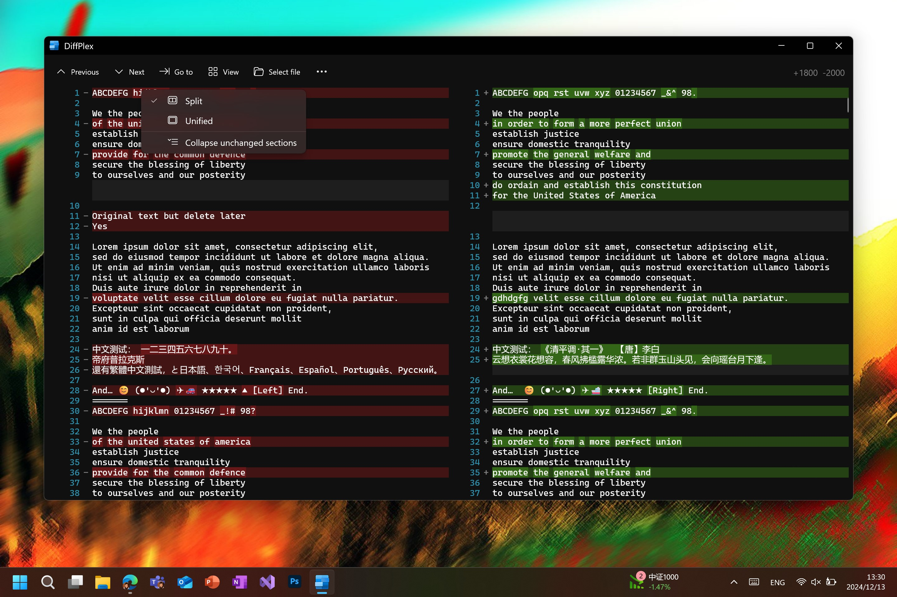

# DiffPlex UI library for Windows

[](https://www.nuget.org/packages/DiffPlex.Windows/)

This library contains WinUI3 elements for textual diffs.

### Import

```csharp
using DiffPlex.UI;
```

And insert following code into the root node of your xaml file.

```
xmlns:diffplex="using:DiffPlex.UI"
```

## Diff text view

Class `DiffTextView` is used to render textual diffs by setting new text and old text.

```xaml
<diffplex:DiffTextView x:Name="DiffView" />
```

```csharp
DiffView.SetText(OldText, NewText);
```



And you can switch to split view or unified view by setting `IsSplitView` member property with a boolean value.

## Diff text window

You can create a window with the above element to show.

```csharp
var window = new DiffTextWindow();
window.Activate();
window.SetText(OldText, NewText);
```
