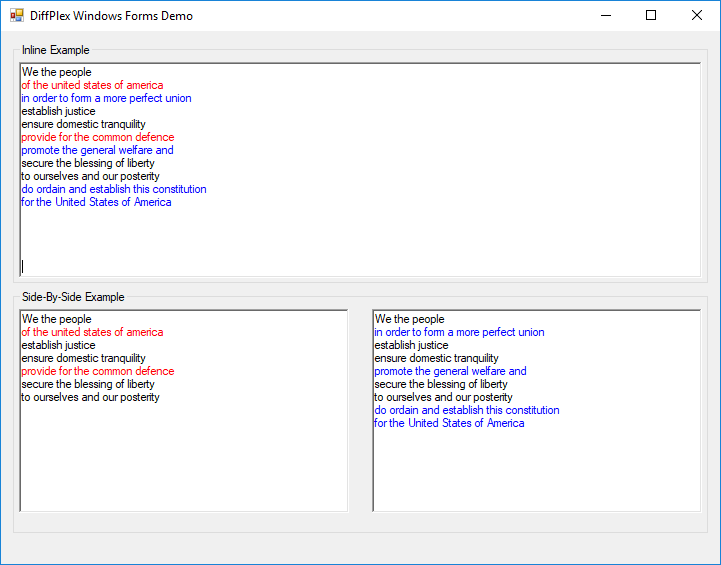

# DiffPlex Windows Forms Demo
This is an example Windows Forms application developed in .NET 4.8 (C#).

This shows how to use both `InlineDiffBuilder` and `SideBySideDiffBuilder` with a standard `System.Windows.Forms.RichTextBox`.

