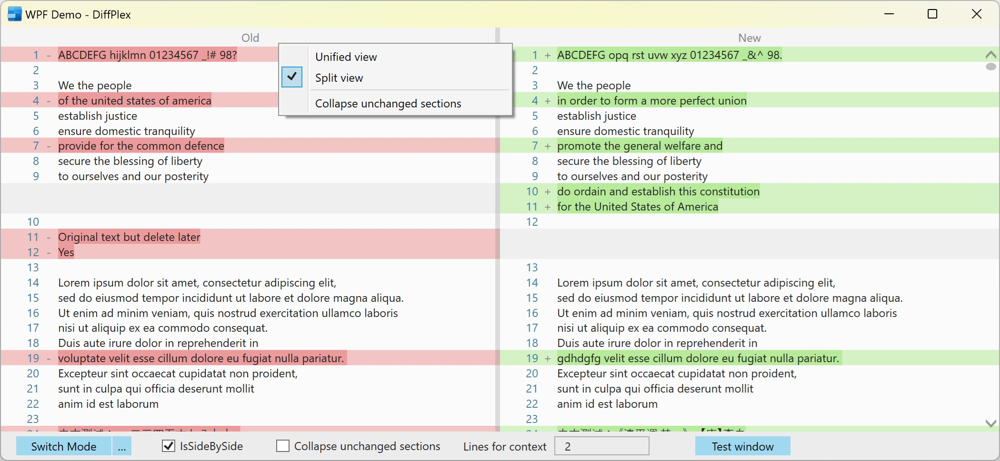

DiffPlex [](https://mmanela.visualstudio.com/DiffPlex/_build/latest?definitionId=5&branchName=master) [](https://www.nuget.org/packages/DiffPlex/)
========

DiffPlex is C# library to generate textual diffs. It targets `netstandard1.0`.

# About the API

The DiffPlex library currently exposes two interfaces for generating diffs:

* `IDiffer` (implemented by the `Differ` class) - This is the core diffing class.  It exposes the low level functions to generate differences between texts.
* `ISidebySideDiffer` (implemented by the `SideBySideDiffer` class) - This is a higher level interface.  It consumes the `IDiffer` interface and generates a `SideBySideDiffModel`.  This is a model which is suited for displaying the differences of two pieces of text in a side by side view.

## Examples

For examples of how to use the API please see the the following projects contained in the DiffPlex solution.

For use of the `IDiffer` interface see:

* `SidebySideDiffer.cs` contained in the `DiffPlex` Project.
* `UnidiffFormater.cs` contained in the `DiffPlex.ConsoleRunner` project.

For use of the `ISidebySideDiffer` interface see:

* `DiffController.cs` and associated MVC views in the `WebDiffer` project
* `TextBoxDiffRenderer.cs` in the `SilverlightDiffer` project

## Sample code

```csharp
var diff = InlineDiffBuilder.Diff(before, after);

var savedColor = Console.ForegroundColor;
foreach (var line in diff.Lines)
{
    switch (line.Type)
    {
        case ChangeType.Inserted:
            Console.ForegroundColor = ConsoleColor.Green;
            Console.Write("+ ");
            break;
        case ChangeType.Deleted:
            Console.ForegroundColor = ConsoleColor.Red;
            Console.Write("- ");
            break;
        default:
            Console.ForegroundColor = ConsoleColor.Gray; // compromise for dark or light background
            Console.Write("  ");
            break;
    }

    Console.WriteLine(line.Text);
}
Console.ForegroundColor = savedColor;
```

## IDiffer Interface 

```csharp 
/// <summary>
/// Provides methods for generate differences between texts
/// </summary>
public interface IDiffer
{
    /// <summary>
    /// Create a diff by comparing text line by line
    /// </summary>
    /// <param name="oldText">The old text.</param>
    /// <param name="newText">The new text.</param>
    /// <param name="ignoreWhiteSpace">if set to <c>true</c> will ignore white space when determining if lines are the same.</param>
    /// <returns>A DiffResult object which details the differences</returns>
    DiffResult CreateLineDiffs(string oldText, string newText, bool ignoreWhiteSpace);

    /// <summary>
    /// Create a diff by comparing text character by character
    /// </summary>
    /// <param name="oldText">The old text.</param>
    /// <param name="newText">The new text.</param>
    /// <param name="ignoreWhitespace">if set to <c>true</c> will treat all whitespace characters are empty strings.</param>
    /// <returns>A DiffResult object which details the differences</returns>
    DiffResult CreateCharacterDiffs(string oldText, string newText, bool ignoreWhitespace);

    /// <summary>
    /// Create a diff by comparing text word by word
    /// </summary>
    /// <param name="oldText">The old text.</param>
    /// <param name="newText">The new text.</param>
    /// <param name="ignoreWhitespace">if set to <c>true</c> will ignore white space when determining if words are the same.</param>
    /// <param name="separators">The list of characters which define word separators.</param>
    /// <returns>A DiffResult object which details the differences</returns>
    DiffResult CreateWordDiffs(string oldText, string newText, bool ignoreWhitespace, char[] separators);

    /// <summary>
    /// Create a diff by comparing text in chunks determined by the supplied chunker function.
    /// </summary>
    /// <param name="oldText">The old text.</param>
    /// <param name="newText">The new text.</param>
    /// <param name="ignoreWhiteSpace">if set to <c>true</c> will ignore white space when determining if chunks are the same.</param>
    /// <param name="chunker">A function that will break the text into chunks.</param>
    /// <returns>A DiffResult object which details the differences</returns>
    DiffResult CreateCustomDiffs(string oldText, string newText, bool ignoreWhiteSpace, Func<string, string[]> chunker);

            /// <summary>
        /// Create a diff by comparing text line by line
        /// </summary>
        /// <param name="oldText">The old text.</param>
        /// <param name="newText">The new text.</param>
        /// <param name="ignoreWhiteSpace">if set to <c>true</c> will ignore white space when determining if lines are the same.</param>
        /// <param name="ignoreCase">Determine if the text comparision is case sensitive or not</param>
        /// <param name="chunker">Component responsible for tokenizing the compared texts</param>
        /// <returns>A DiffResult object which details the differences</returns>
        DiffResult CreateDiffs(string oldText, string newText, bool ignoreWhiteSpace, bool ignoreCase, IChunker chunker);
}
```

## IChunker Interface

```csharp
public interface IChunker
{
    /// <summary>
    /// Dive text into sub-parts
    /// </summary>
    string[] Chunk(string text);
}
```

Currently provided implementations:

- `CharacterChunker`
- `CustomFunctionChunker`
- `DelimiterChunker`
- `LineChunker`
- `LineEndingsPreservingChunker`
- `WordChunker`


## ISideBySideDifferBuilder Interface

```csharp
/// <summary>
/// Provides methods that generate differences between texts for displaying in a side by side view.
/// </summary>
public interface ISideBySideDiffBuilder
{
    /// <summary>
    /// Builds a diff model for  displaying diffs in a side by side view
    /// </summary>
    /// <param name="oldText">The old text.</param>
    /// <param name="newText">The new text.</param>
    /// <returns>The side by side diff model</returns>
    SideBySideDiffModel BuildDiffModel(string oldText, string newText);
}
```

## Sample Website

DiffPlex also contains a sample website that shows how to create a basic side by side diff in an ASP MVC website.


# WPF Controls

[](https://www.nuget.org/packages/DiffPlex.Wpf/)

DiffPlex WPF control library `DiffPlex.Wpf` is used to render textual diffs in your WPF application.
It targets `.NET Core 3.1`.

```csharp
using DiffPlex.Wpf.Controls;
```

To import the controls into your window/page/control, please insert following attribute into the root node (such as `<Window />`) of your xaml files.

```
xmlns:diffplex="clr-namespace:DiffPlex.Wpf.Controls;assembly=DiffPlex.Wpf"
```

Then you can add one of following controls in UI.

- `DiffViewer` Textual diffs viewer control with view mode switching by setting an old text and a new text to diff.
- `SideBySideDiffViewer` Side-by-side (splitted) textual diffs viewer control by setting a diff model `SideBySideDiffModel`.
- `InlineDiffViewer` Inline textual diffs viewer control by setting a diff model `DiffPaneModel`.

For example.

```xaml
<diffplex:DiffViewer x:Name="DiffView" />
```

```csharp
DiffView.OldText = oldText;
DiffView.NewText = newText;
```



You can also customize the style.
Following are some of the properties you can get or set.

```csharp
// The header of old text.
public string OldTextHeader { get; set; }

// The header of new text.
public string NewTextHeader { get; set; }

// The header of new text.
public string NewTextHeader { get; }

// The font size.
public double IsSideBySideViewMode { get; set; }

// The preferred font family.
public FontFamily FontFamily { get; set; }

// The font weight.
public FontWeight FontWeight { get; set; }

// The font style.
public FontStyle FontStyle { get; set; }

// The font-stretching characteristics.
public FontStretch FontStretch { get; set; }

// The default text color (foreground brush).
public Brush Foreground { get; set; }

// The background brush of the line inserted.
public Brush InsertedBackground { get; set; }

// The background brush of the line deleted.
public Brush DeletedBackground { get; set; }

// The text color (foreground brush) of the line number.
public Brush LineNumberForeground { get; set; }

// The width of the line number and change type symbol.
public int LineNumberWidth { get; set; }

// The background brush of the line imaginary.
public Brush ImaginaryBackground { get; set; }

// The text color (foreground brush) of the change type symbol.
public Brush ChangeTypeForeground { get; set; }

// The background brush of the header.
public Brush HeaderBackground { get; set; }

// The height of the header.
public double HeaderHeight { get; set; }

// The background brush of the grid splitter.
public Brush SplitterBackground { get; set; }

// The width of the grid splitter.
public Brush SplitterWidth { get; set; }

// A value that represents the actual calculated width of the left side panel.
public double LeftSideActualWidth { get; }

// A value that represents the actual calculated width of the right side panel.
public double RightSideActualWidth { get; }
```

And you can listen following event handlers.

```csharp

// Occurs when the grid splitter loses mouse capture.
public event DragCompletedEventHandler SplitterDragCompleted;

// Occurs one or more times as the mouse changes position when the grid splitter has logical focus and mouse capture.
public event DragDeltaEventHandler SplitterDragDelta;

// Occurs when the grid splitter receives logical focus and mouse capture.
public event DragStartedEventHandler SplitterDragStarted;

// Occurs when the view mode is changed.
public event EventHandler<ViewModeChangedEventArgs> ViewModeChanged;
```
